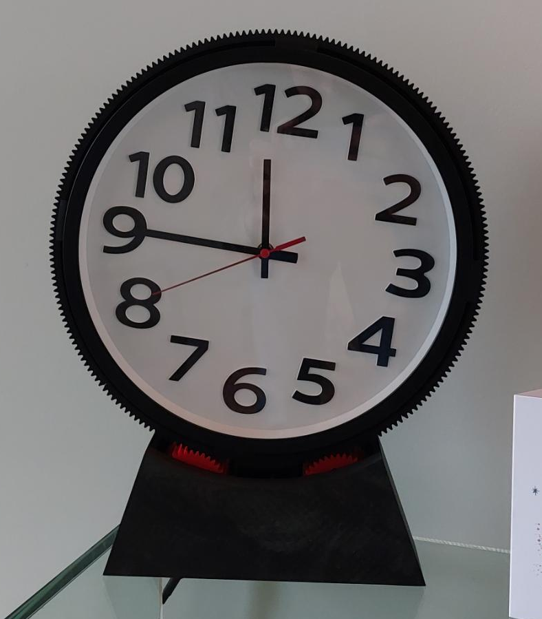

# Roatating Clock Device

This project rotates an entire analog wall clock so that **one selected hand remains stationary with respect to the room**.

The clock itself is a standard off-the-shelf wall clock. It is mounted inside a rigid outer ring with gear teeth. By rotating this ring at a carefully controlled speed (using a stepper motor and reduction gearing), the apparent motion of the second, minute, or hour hand can be canceled.

<kbd></kbd>

---

## How it works

- The clock is mounted in a circular frame with an external ring gear.
- A stepper motor drives this ring through a reduction gear train.
- The motor speed is chosen such that the rotation of the clock body exactly matches the angular speed of one clock hand.
- A switch selects which hand (second, minute, or hour) should appear stationary.

The clock mechanism itself is not modified.

---

## Repository contents

- **`/src`**  
  Arduino code for driving the stepper motor and handling mode selection.

- **`/3mf`**  
  3MF files for all 3D-printed mechanical parts (ring gear, mounts, brackets, etc.).

---

## Parts used

- Standard analog wall clock
- Arduino Nano (ATmega328P)
- Bipolar stepper motor
- L298-based H-bridge motor driver
- 3D-printed parts (see `stl/` folder)
- Large ring gear (printed, 216 teeth)
- Small drive gear (printed, 36 teeth)
- 16-tooth timing pulleys (motor and driven shaft)
- Timing belt (matching pulleys)
- 3-position switch
- Miscellaneous hardware (bearings, fasteners, wiring)

## Video

https://github.com/user-attachments/assets/ff5681fa-3189-4641-85de-ae808c66d57e

